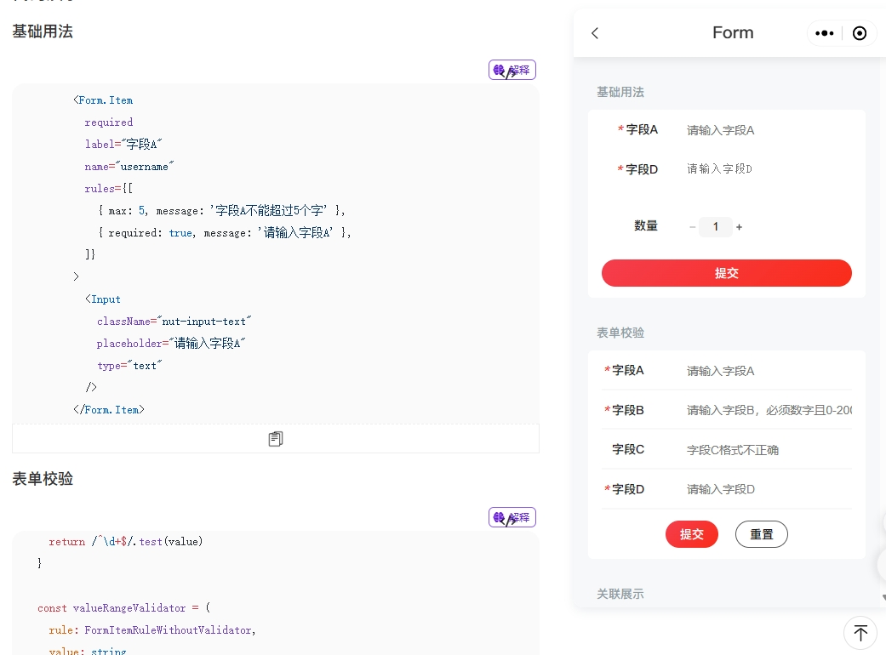

# 物料组件库、协议和渲染器、designable设计器

## 协议驱动

本项目的H5和小程序动态渲染最核心的依赖是 `Formily.js` 的 `JSON Schema` 渲染能力
先可看官方文档
[协议驱动简单介绍](https://formilyjs.org/zh-CN/guide#%E5%8D%8F%E8%AE%AE%E9%A9%B1%E5%8A%A8)
[Schema协议详细介绍](https://react.formilyjs.org/zh-CN/api/shared/schema)

以todolist中每一项任务右边的删除按钮为示例

```
{
  type: 'void', // 类型 void类型表单项就是没有关联表单数据
  title: 'Icon', // 标题 一般标题用于显示在FormItem（x-decorator 字段 UI 包装器组件）
  'x-component': 'Icon', // 字段 UI 组件
  'x-component-props': { // 字段 UI 组件属性，就是业务组件Props能拿到的参数
    iconName: 'check-disabled',
    style: {}, // 组件样式
    eventsConfig: { // 本项目实现的事件配置
      scriptClick: { // 点击事件配置
        propsOperatorsArray: [ // 事件函数入参
          'console.log($index), $array.field.remove($index)',
        ],
        api: 'runStatement', // 事件要调用的api
      },
      scriptClose: {},
    },
  },
  'x-designable-id': '956d01mudrx',
  'x-index': 1,
}
```

## 组件库准备

使用 `@nutui/nutui-react-taro`
https://nutui.jd.com/taro/react/2x/#/zh-CN/guide/intro-react

### Formily组件编写

可参考 `ui/src/components` 目录

Formily 的字段模型核心包含了两类字段模型：数据型字段和虚数据型字段
数据型字段(Field)，核心是负责维护表单数据(表单提交时候的值)。
虚数据型字段(VoidField)，你可以理解为它就是一个阉割了数据维护能力的 Field，所以它更多的是作为容器维护一批字段的 UI 形式。
[字段模型](https://core.formilyjs.org/zh-CN/guide/field)

那在 `ui/src/components` 目录中，Widget开头的组件和Button是VoidField，只用来展示UI的，不跟表单数据做关联，
其余的像 CheckBox、DatePicker、Input组件是跟表单数据做关联的，用 `@formily/react` 中的 `connect`, `mapProps` 方法包装组件来连接表单，最基础的数据型组件要求Props有 `value` 和 `onChange`

### Form组件

Form组件是地基，接收一个Form实例，渲染children内容。
本项目里 packages/ui/src/components里面 实现了Form组件和FormPage组件，
FormPage组件除了formily提供的能力外就是一个Taro的View组件，
Form组件则多了nutui Form组件的样式

FormPage组件代码如下

```tsx
import React, { createContext, useContext } from 'react'
import { Form as FormType, ObjectField } from '@formily/core'
import {
  ExpressionScope,
  FormProvider,
  JSXComponent,
  useParentForm,
} from '@formily/react'
import { View } from '@tarojs/components'

import { PreviewText } from '../PreviewText'

export interface IFormPageProps {
  form?: FormType
  component?: JSXComponent
  previewTextPlaceholder?: React.ReactNode
  className?: string
  style?: React.CSSProperties
}

export const FormPage: React.FC<React.PropsWithChildren<IFormPageProps>> = ({
  form,
  component,
  previewTextPlaceholder,
  className,
  style,
  children,
}) => {
  const top = useParentForm()
  // 重要的是这里 我们的Form组件就简单的用Taro的View组件包住子组件渲染
  // ExpressionScope是用context来给 json-schema 表达式传递局部作用域，我们可以用它当做数据源
  // PreviewText.Placeholder也是一个context 给预览态显示文本一个缺省值，目前也不重要
  const renderContent = (_form: FormType | ObjectField) => (
    <ExpressionScope value={{ $$form: _form }}>
      <PreviewText.Placeholder value={previewTextPlaceholder}>
        <View className={className} style={style}>
          {children}
        </View>
      </PreviewText.Placeholder>
    </ExpressionScope>
  )
  if (form)
    // 最重要的是这里，有FormProvider才能提供MVVM能力，进行微操
    return <FormProvider form={form}>{renderContent(form)}</FormProvider>
  if (!top) throw new Error('must pass form instance by createForm')
  return renderContent(top)
}

export default FormPage
```

### FormItem

`nutui` 提供了一些表单组件


如图所见FormItem的作用就是显示label、必填、校验文案等，并且让表单布局更加美观，我们需要混入Formily能力。
我们要改造一下FormItem的最外层，要让designable属性能够挂到dom上，并且阉割掉原来UI库有关Form的功能，化为己用。
用 `@formily/react` 的 `connect`，`mapProps` 来让FormItem组件可以链接到表单

### Input

Input组件适配Formily代码如下

```tsx
import React from 'react'
import { connect, mapProps, mapReadPretty } from '@formily/react'
import { Input as component } from '@taroify/core'

import { PreviewText } from '../PreviewText'

export const Input = connect(
  component,
  mapProps((props, field) => {
    return {
      ...props
    }
  }),
  mapReadPretty(PreviewText.Input)
)
```

是不是灰常简单

### SchemaField

最后我们用 `createSchemaField` 包一层，生成属于 `taroify` 的渲染器

```ts
import { createSchemaField } from '@formily/react'

import {
  Button,
  CellGroup,
  Checkbox,
  DatetimePicker,
  FormItem,
  Input,
  Radio,
  Rate,
  Slider,
  Stepper,
  Switch,
  WidgetBase,
} from './index'

export const SchemaField = createSchemaField({
  components: {
    Button,
    CellGroup,
    Checkbox,
    DatetimePicker,
    FormItem,
    Input,
    Radio,
    Rate,
    Slider,
    Stepper,
    Switch,
    WidgetBase,
  },
})

```

组件库准备好了之后，我们可以选择用 `rollup` 打包，也可以选择在项目中直接使用 `tsx` 文件。

## designable使用Taro组件

由于 `Taro` 跨端的特性，让组件库在 `h5` 环境下展示是一定可以的，不过有两种方案：

1. 用完整的Taro项目，接入部分designable能力，最后以iframe的形式嵌入PC设计器中
2. PC设计器营造 `h5` 端的氛围，让Taro组件直接展示，不经过 `@tarojs/cli` 打包

我选择了方案二，感觉比较简单，因为不需要跨iframe通信，而且觉得`@tarojs/cli`打包到h5比较慢（这里没有经过验证）。

**那么如何营造 `Taro h5` 氛围呢？**
首先 `@tarojs/components` 使⽤了 `Stencil` 去实现了⼀个基于 `WebComponents` 且遵循微信⼩程序规范的组件库，用 `reactify-wc` 让React项目中能够使用 `WebComponent`，`stenciljs` 打包的组件产物中有 `defineCustomElements`，调用一下才可以把 `WebComponents` 注册到浏览器中

我们在设计器项目中需要把该方法导出来用一下，还需要引入Taro组件样式
其余H5页面处理可以看 `node_modules/@tarojs/taro-loader/lib/h5.js`

在设计器 `main.tsx` 中

```tsx
import { defineCustomElements } from '@tarojs/components/dist/esm/loader.js'
import '@tarojs/components/dist/taro-components/taro-components.css'
defineCustomElements(window)
```

接着webpack配置还要处理两个地方
参考 `plugin-framework-react` 这个taro包中的处理
在 'node_modules/@tarojs/plugin-framework-react/dist/index.js' 文件中，有个 `modifyH5WebpackChain` 方法来处理编译到H5时的webpack配置

```js
function modifyH5WebpackChain(ctx, framework, chain) {
    var _a;
    setLoader$1(framework, chain);
    setPlugin(ctx, framework, chain);
    const { isBuildNativeComp = false } = ((_a = ctx.runOpts) === null || _a === void 0 ? void 0 : _a.options) || {};
    const externals = {};
    if (isBuildNativeComp) {
        // Note: 该模式不支持 prebundle 优化，不必再处理
        externals.react = {
            commonjs: 'react',
            commonjs2: 'react',
            amd: 'react',
            root: 'React'
        };
        externals['react-dom'] = {
            commonjs: 'react-dom',
            commonjs2: 'react-dom',
            amd: 'react-dom',
            root: 'ReactDOM'
        };
        if (framework === 'preact') {
            externals.preact = 'preact';
        }
        chain.merge({
            externalsType: 'umd'
        });
    }
    chain.merge({
        externals,
        module: {
            rule: {
                'process-import-taro-h5': {
                    test: /taro-h5[\\/]dist[\\/]api[\\/]taro/,
                    loader: require.resolve('./api-loader')
                }
            }
        },
    });
    chain.merge({
        externals,
        module: {
            rule: {
                'process-import-taro-harmony-hybrid': {
                    test: /plugin-platform-harmony-hybrid[\\/]dist[\\/]api[\\/]apis[\\/]taro/,
                    loader: require.resolve('./api-loader')
                }
            }
        },
    });
}
function setLoader$1(framework, chain) {
    function customizer(object = '', sources = '') {
        if ([object, sources].every(e => typeof e === 'string'))
            return object + sources;
    }
    chain.plugin('mainPlugin')
        .tap(args => {
        args[0].loaderMeta = lodash.mergeWith(getLoaderMeta(framework), args[0].loaderMeta, customizer);
        return args;
    });
}
function setPlugin(ctx, framework, chain) {
    var _a, _b;
    const config = ctx.initialConfig;
    const webpackConfig = chain.toConfig();
    const isProd = webpackConfig.mode === 'production';
    if (!isProd && ((_b = (_a = config.h5) === null || _a === void 0 ? void 0 : _a.devServer) === null || _b === void 0 ? void 0 : _b.hot) !== false) {
        // 默认开启 fast-refresh
        if (framework === 'react') {
            chain
                .plugin('fastRefreshPlugin')
                .use(require('@pmmmwh/react-refresh-webpack-plugin'));
        }
        else if (framework === 'preact') {
            chain
                .plugin('hotModuleReplacementPlugin')
                .use(require('webpack').HotModuleReplacementPlugin);
            chain
                .plugin('fastRefreshPlugin')
                .use(require('@prefresh/webpack'));
        }
    }
}
```

```ts
export default {
  resolve: {
    modules: ['node_modules'],
    extensions: ['.js', '.jsx', '.ts', '.tsx', '.json'],
    alias: {
      '@tarojs/components$': '@tarojs/components/dist-h5/react', // taro3.6及以上为  @tarojs/components/lib/react
      '@tarojs/taro': '@tarojs/taro-h5',
    },
  },
  module: {
    rules: [
      {
        test: /taro-h5[\\/]dist[\\/]index/,
        loader: require.resolve(
          '@tarojs/plugin-framework-react/dist/api-loader.js'
        ),
      },
      ...
    ],
  },
  ...
}
```

这样就可以获得一个残缺的 `Taro h5 React` 环境，会有一些api不支持，比如路由跳转。

要开始使用 `taroify-formily`，还得先引入它的爸爸 `taroify` 组件库的样式

```tsx
import '@taroify/icons/index.scss'
import '@taroify/core/index.scss'
```

### 组件封装物料

组件封装物料，主要是添加 `Behavior` 和 `createResource`，重点还是 `Behavior`

Form组件处理，`Behavior` 中的 `propsSchema` 就是最主要的部分，`type` 定义了Form组件绑定的是对象字段模型，`properties` 中定义了 `style` 需要编辑。

我们看看 `style` 有些什么东西，以下代码展示了 `style` 的各个字段可以用 `Select`、`SizeInput`、`BackgroundStyleSetter` 等 `designable` 提供的配置器去配置属性，由 `x-component` 指定

```ts
import { ISchema } from '@formily/react'

export const CSSStyle: ISchema = {
  type: 'void',
  properties: {
    'style.position': {
      type: 'string',
      'x-decorator': 'FormItem',
      default: 'relative',
      'x-component': 'Select',
      enum: [
        { label: 'static', value: 'static' },
        { label: 'relative', value: 'relative' },
        { label: 'absolute', value: 'absolute' },
        { label: 'fixed', value: 'fixed' },
        { label: 'sticky', value: 'sticky' },
      ],
    },
    'style.top': {
      type: 'string',
      'x-decorator': 'FormItem',
      'x-component': 'SizeInput',
      default: '0px',
    },
    'style.left': {
      type: 'string',
      'x-decorator': 'FormItem',
      'x-component': 'SizeInput',
      default: '0px',
    },
    'style.right': {
      type: 'string',
      'x-decorator': 'FormItem',
      'x-component': 'SizeInput',
      default: '0px',
    },
    'style.bottom': {
      type: 'string',
      'x-decorator': 'FormItem',
      'x-component': 'SizeInput',
      default: '0px',
    },
    'style.width': {
      type: 'string',
      'x-decorator': 'FormItem',
      'x-component': 'SizeInput',
    },
    'style.height': {
      type: 'string',
      'x-decorator': 'FormItem',
      'x-component': 'SizeInput',
    },
    'style.display': {
      'x-component': 'DisplayStyleSetter',
    },
    'style.background': {
      'x-component': 'BackgroundStyleSetter',
    },
    'style.boxShadow': {
      'x-component': 'BoxShadowStyleSetter',
    },
    'style.font': {
      'x-component': 'FontStyleSetter',
    },
    'style.margin': {
      'x-component': 'BoxStyleSetter',
    },
    'style.padding': {
      'x-component': 'BoxStyleSetter',
    },
    'style.borderRadius': {
      'x-component': 'BorderRadiusStyleSetter',
    },
    'style.border': {
      'x-component': 'BorderStyleSetter',
    },
    'style.opacity': {
      'x-decorator': 'FormItem',
      'x-component': 'Slider',
      'x-component-props': {
        defaultValue: 1,
        min: 0,
        max: 1,
        step: 0.01,
      },
    },
  },
}
```

```tsx
import React, { useMemo } from 'react'
import { createBehavior, createResource } from '@pind/designable-core'
import { DnFC, usePrefix } from '@pind/designable-react'
import { createForm } from '@formily/core'
import { observer } from '@formily/react'
import * as lodash from 'lodash-es'
import { Form as FormilyForm } from 'taroify-formily/lib'

import { AllLocales } from '../../locales'
import { AllSchemas } from '../../schemas'

export const Form: DnFC<React.ComponentProps<typeof FormilyForm>> = observer(
  (props) => {
    const form = useMemo(
      () =>
        createForm({
          designable: true,
        }),
      []
    )
    return (
      <FormilyForm
        {...props}
        form={form}
      >
        {props.children}
      </FormilyForm>
    )
  }
)

Form.Behavior = createBehavior({
  name: 'Form',
  selector: (node) => node.componentName === 'Form',
  designerProps(node) {
    return {
      draggable: !node.isRoot,
      cloneable: !node.isRoot,
      deletable: !node.isRoot,
      droppable: true,
      propsSchema: {
        type: 'object',
        properties: {
          style: {
            type: 'void',
            properties: lodash.omit(AllSchemas.CSSStyle.properties as object, ['style.position', 'style.top', 'style.left', 'style.right', 'style.bottom'])
          },
        },
      },
      defaultProps: {
      },
    }
  },
  designerLocales: AllLocales.Form,
})

Form.Resource = createResource({
  title: { 'zh-CN': '表单' },
  icon: 'FormLayoutSource',
  elements: [
    {
      componentName: 'Field',
      props: {
        type: 'object',
        'x-component': 'Form',
      },
    },
  ],
})

```

so，表单组件在 `designable` 中有一些样式可以配置


#### Input组件封装物料

为什么跳过了 `FormItem` 呢，因为它是角色是其他组件的装饰器，它的属性在装饰目标组件上配置就可以了

Input组件处理

```tsx
import React from 'react'
import { createBehavior, createResource } from '@pind/designable-core'
import { DnFC } from '@pind/designable-react'
import { Input as component } from 'taroify-formily/lib'

import { AllLocales } from '../../locales'
import { AllSchemas } from '../../schemas'
import { createFieldSchema } from '../Field'

export const Input: DnFC<React.ComponentProps<typeof component>> = component
const propsSchema = createFieldSchema({
  component: AllSchemas.Input,
  props: {
    'component-events-group': []
  }
}) as any

Input.Behavior = createBehavior(
  {
    name: 'Input',
    extends: ['Field'],
    selector: (node) => node.props['x-component'] === 'Input',
    designerProps: {
      propsSchema,
      defaultProps: {
      },
    },
    designerLocales: AllLocales.Input
  },
)

Input.Resource = createResource(
  {
    icon: 'InputSource',
    elements: [
      {
        componentName: 'Field',
        props: {
          type: 'string',
          title: 'Input',
          'x-decorator': 'FormItem',
          'x-component': 'Input',
        },
      },
    ],
  },
)

```

`createFieldSchema` 中封装了很多field模型的行为，例如 title(label)、校验规则、联动逻辑等在 `designable` 中如何配置。提前介绍一下如何微操低代码页面

首先准备两个Input，一个叫a，一个叫b


第二部点击b组件右侧的响应器配置，配置它的显示规则为当a字段的值为`hidden`时隐藏

在拖拉拽面板中是designable提供的react渲染器，切换到运行面板用Formily渲染器才有MVVM能力

随着我们在a输入框中输入`hidden`，b输入框就会神奇的消失了


### designable正式使用物料

准备预览运行面板，使用 `Form组件` 和 `SchemaField组件` 提供运行时渲染能力，与实际消费端的区别是需要用 `designable` 提供的 `transformToSchema` 把拖拉拽面板中的组件树转成JSON协议。

```js
import React, { useMemo } from 'react'
import { transformToSchema } from '@pind/designable-formily-transformer'
import { createForm } from '@formily/core'
import { createSchemaField, FormProvider } from '@formily/react'
import {
  CellGroup,
  Form,
  FormItem,
  Input,
  SchemaField,
  WidgetBase,
} from 'taroify-formily/lib'

export interface IPreviewWidgetProps {
  tree: any
}

export const PreviewWidget: React.FC<IPreviewWidgetProps> = (props) => {
  const form = useMemo(() => createForm(), [])
  const { form: formProps, schema } = transformToSchema(props.tree)
  return (
    <Form {...formProps} form={form}>
      <SchemaField schema={schema} />
    </Form>
  )
}
```

designable main.tsx处理。主要有 `CompositePanel`、`WorkspacePanel`、`SettingsPanel` 三大区域。

`CompositePanel`区域我们只需要把物料放入`ResourceWidget`中即可。

`WorkspacePanel`放了三个`ViewPanel`，分别是拖拉拽面板、JSON编辑面板、预览运行时渲染面板，我们需要把物料放入拖拉拽面板中再次注册一下，需要把 预览运行时组件塞进

```tsx
const App = () => {
  const engine = useMemo(
    () =>
      createDesigner({
        rootComponentName: 'Form',
      }),
    []
  )

  return (
    <Designer engine={engine}>
      <Workbench>
        <StudioPanel logo={<Logo />} actions={<Actions />}>
          <CompositePanel>
            <CompositePanel.Item title="panels.Component" icon="Component">
              <ResourceWidget
                title="sources.Inputs"
                sources={[Input, Checkbox, Radio, Rate]}
              />
              <ResourceWidget title="sources.Displays" sources={[Button]} />
              <ResourceWidget
                title="sources.Layouts"
                sources={[WidgetBase, CellGroup]}
              />
            </CompositePanel.Item>
            <CompositePanel.Item title="panels.OutlinedTree" icon="Outline">
              <OutlineTreeWidget />
            </CompositePanel.Item>
            <CompositePanel.Item title="panels.History" icon="History">
              <HistoryWidget />
            </CompositePanel.Item>
          </CompositePanel>
          <WorkspacePanel> //工作区域
            <ToolbarPanel>
              <DesignerToolsWidget />
              <ViewToolsWidget use={['DESIGNABLE', 'JSONTREE', 'PREVIEW']} />
            </ToolbarPanel>
            <ViewportPanel
              style={{ minHeight: '100%', width: '750px', overflow: 'overlay' }}
            >
              <ViewPanel type="DESIGNABLE">
                {() => (
                  <ComponentTreeWidget
                    components={{
                      Button,
                      CellGroup,
                      Checkbox,
                      Form,
                      Field,
                      Input,
                      Radio,
                      Rate,
                      WidgetBase,
                    }}
                  />
                )}
              </ViewPanel>
              <ViewPanel type="JSONTREE" scrollable={false}>
                {(tree, onChange) => (
                  <SchemaEditorWidget tree={tree} onChange={onChange} />
                )}
              </ViewPanel>
              <ViewPanel type="PREVIEW">
                {(tree) => <PreviewWidget tree={tree} />}
              </ViewPanel>
            </ViewportPanel>
          </WorkspacePanel>
          <SettingsPanel title="panels.PropertySettings">
            <SettingsForm uploadAction="https://www.mocky.io/v2/5cc8019d300000980a055e76" />
          </SettingsPanel>
        </StudioPanel>
      </Workbench>
    </Designer>
  )
}

ReactDOM.render(<App />, document.getElementById('root'))
```

## 运行一下

目前只有一些组件，先配置一些普通的页面吧


到这里前端页面可视化搭建系统的第一步已经迈出来，有了基本的`组件库`、`协议和渲染器`，并且在`设计器`中可以配置组件属性最终渲染界面，下篇文章再介绍如何让 `小程序` 和 `H5` 渲染设计器产出的`JSONSchema`。
