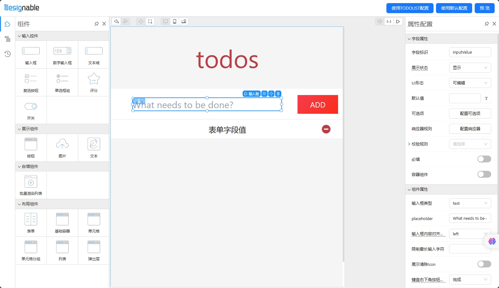
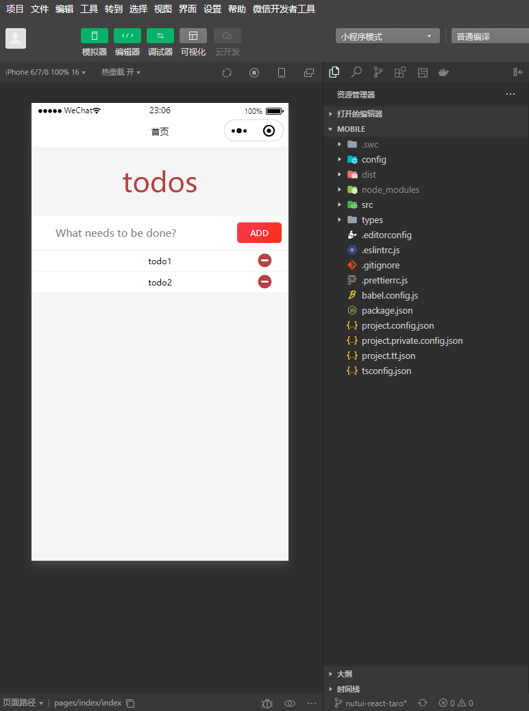
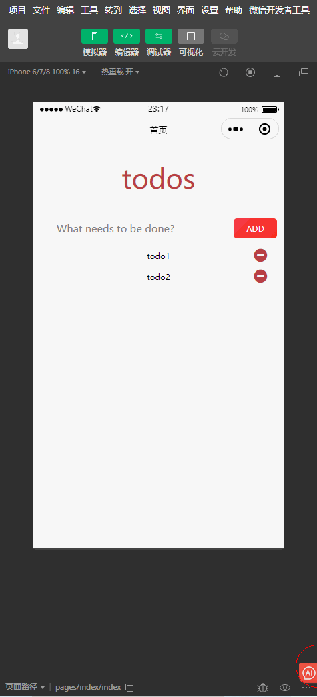

# 基于 Designable 开发 Taro小程序前端页面可视化搭建工具

## 目录介绍

├─ packages
  ├─ editor: 基于 `Designable` + `Formily.js` 实现的页面可视化搭建设计器，使用 `rspack` 构建，并做了兼容Taro组件H5渲染处理
  ├─ mobile: Taro项目demo例子
  ├─ ui: 使用 `@nutui/nutui-react-taro` 组件库做的适配formily的组件

## 预览地址

可视化设计器（体积很大，注意流量，最好用PC打开） <https://lowcode-designable-taro-react.vercel.app>
demo H5（按 F12 切换设备仿真） <https://lowcode-designable-taro-react-mobile.vercel.app>
需要VPN




## 使用演示

### todoList



### 制作表单


### 联动逻辑 配置响应器


### 配置图标


## 项目启动

**依赖安装**
本项目用了pnpm去做monorepo
根目录下

```bash
npm i -g pnpm
pnpm
```

**Taro Demo运行**
packages/mobile 目录下
编译微信小程序或淘宝(支付宝)小程序、h5

```bash
pnpm dev:weapp
```

```bash
pnpm dev:alipay
```

```bash
pnpm dev:h5
```

**可视化设计器启动**
packages/editor 目录下
`packages/editor/start.js` 中可修改 `Taro Demo` 地址

```bash
npm start
```

## 介绍文章

目前组件比较少，如有需要上生产建议按自身业务搭一套

> - 低代码入门介绍
> - [低代码渲染那些事](https://zhuanlan.zhihu.com/p/540339437)
> - [从实现原理看低代码](https://zhuanlan.zhihu.com/p/451340998)

> - Formily.js 表单解决方案
> - [Formily.js官网](https://formilyjs.org/zh-CN/guide/learn-formily)
> - [Formily学习笔记](https://github.com/cgfeel/formily)

> - [alibaba/designable](https://github.com/alibaba/designable)
> - 跟Formily.js是同一个作者，目前不维护了，这个fork [@pind/designable](https://github.com/pindjs/designable) 功能更新一点
> - 没有文档，可以看一些非官方文章或视频教程
> - [表单设计器开发指南](https://formilyjs.org/zh-CN/guide/form-builder)
> - [Designable 应用和源码浅析](https://zhuanlan.zhihu.com/p/431263711)
> - [Designable其他解读文章](https://www.yuque.com/xjchenhao/development/rncluc)

## 设计器目录详细介绍

├─ editor
  ├─ src
    ├─ common 一些组件
    ├─ components 物料组件
    ├─ designable designable源代码copy
      ├─ designable-core 核心逻辑
      ├─ designable-formily-setters 右侧属性配置栏中复杂属性配置组件
      ├─ designable-formily-transformer designable的TreeNode与formily的Schema格式互转方法
      ├─ designable-react 设计器界面组件
      ├─ designable-shared 通用方法
    ├─ hooks/useDropTemplate 拖拽物料组件后的处理
    ├─ locales 国际化配置
    ├─ schemas 物料组件右侧属性配置栏配置
    ├─ service 保存页面配置方法
    ├─ widgets 一些组件设计器界面组件
    ├─ app.tsx 设计器主界面
    ├─ index.tsx 入口
